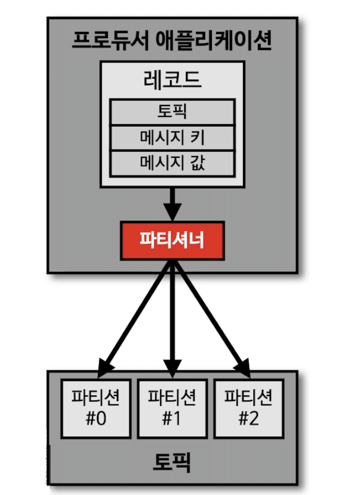
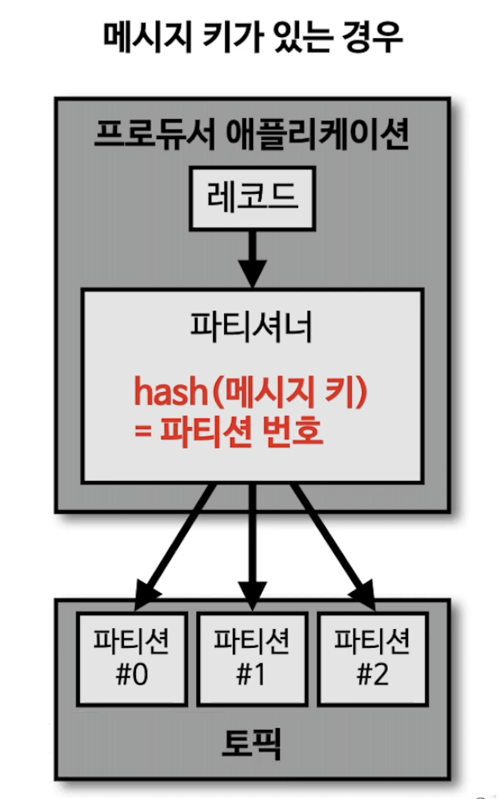
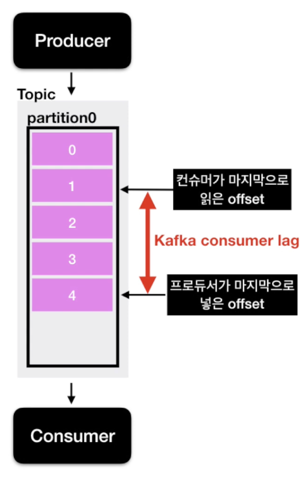
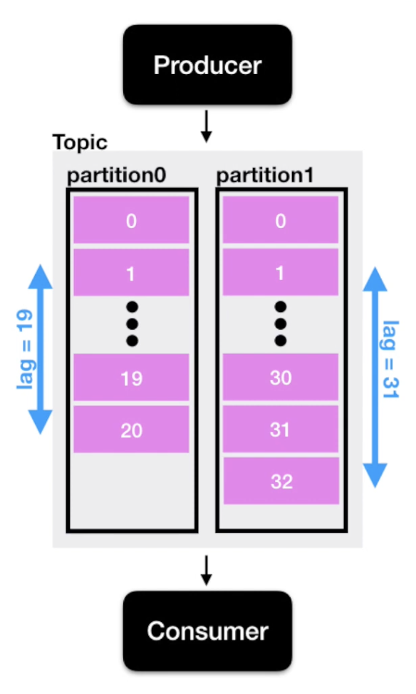

# 아파치 카프카 for beginner
## 1. 아파치 카프카 기초
### 카프카 특징 
- Source Application과 Tager Application의 coupling을 약하게 하기 위해 출시되었다.
  - Source Application의 데이터 포멧은 거의 제한이 없다.
    - json, tsv, auro, etc...

### 토픽이란?
- 데이터가 들어갈 수 있는 공간이다.
- 카프카에서는 토픽을 여러 개 생성할 수 있다.
  - 토픽은 데이터베이스의 테이블이 파일 시스템의 폴더와 유사한 성질을 가지고 있다.
  - 이 토픽에 프로듀서가 데이터를 넣게 되고 컨슈머가 이 데이터를 가져가게 된다.
- 토픽은 이름을 가질 수 있다.
  - 목적에 따라 click_log, send_sms, location_log 등과 같이 무슨 데이터를 담는지 먕확하게 관리하면 유지보수에 도움이 된다.
- 하나의 토픽은 여러개의 파티션으로 구성될 수 있다.
  - 첫번째 파티션의 경우 0번부터 시작한다.
  - 하나의 파티션은 큐와 같이 내부의 데이터가 파티션 끝에서부터 쌓이게 된다.
    - 컨슈머는 데이터를 가장 오래된 순서대로 가져간다.
      - 컨슈머가 record들을 가져가도 데이터는 삭제 되지 않는다.
        - Q : 왜 삭제되지 않을까?
        - A : 컨슈머 그룹이 다르고 auto.offset.reset = earliest로 설정된 새로운 컨슈머가 붙어서 다시 사용할 수 있다.
          - **이처럼 사용할 경우 동일 데이터에 대해서 두 번 처리할 수 있는데 이는 카프카를 사용하는 아주 중요한 이유이다.** 
          - (EX: 클릭 로그 분석 시각화를 위해서 엘라스틱 서치에 저장하기 위해, 클릭로그 백업 etc)
    - 컨슈머는 더 이상 데이터가 들어오지 않으면 또 다른 데이터가 들어올 때까지 기다린다.
  - 파티션이 여러 개인 경우
    1. 키가 null이고, 기본 파티셔너를 사용할 경우 
      - 라운드 로빈(Round robin)으로 할당
    2. 키가 있고, 기본 파티셔너를 사용할 경우
      - 키의 해시(hash) 값을 구하고, 특정 파티션에 할당 
    - 파티션은 늘리는 건 가는하지만 다시 줄일 수 없기 때문에 조심해야 한다.  
    - Q : 파티션을 왜 늘리는걸까?
    - A : 파티션을 늘리면 컨슈머 갯수를 늘려서 데이터 처리를 분산시킬 수 있다.
    - Q : 파티션의 레코드는 언제 삭제되는가? 
    - A : 삭제되는 타이밍은 옵션에 따라 다르다. 
      - 레코드가 저장되는 최대 시간과 크기를 지정할 수 있다.
      - 이를 지정하게 디면 일정한 기간 혹은 용량동안 데이터를 저장할 수 있게 되고 적절하게 데이터가 삭제될 수 있도록 설정할 수 있다.

### 핵심 요소 3가지 : 브로커, 복제, ISR(In-Sync-Replication)
- 브로커
  - 카프카가 설치되어 있는 서버 단위를 뜻한다.
  - 보통 3개 이상의 브로커를 구성하여 사용하는 것을 권장한다.
- 복제(Replication) 
  - 카프카 아키텍쳐의 핵심이다.
  - 파티션의 고가용성을 위해 사용된다.
    - Q : Replication이 고가용성을 위해 중요한 역할을 한다면 많을수록 좋은거 아니야?
    - A : Replication 개수가 많아지면 그만큼 브로커의 리소스 사용량도 늘어나게 된다.
      - 따라서 카프카에 들어오는 데이터량과 저장시간(retention date)을 잘 생각해서 갯수를 정해야 한다.
  - 클러스터에서 서버가 장애가 생길 때 카프카의 가용성을 보장하는 가장 좋은 방법이 복제이기 때문이다.
  - 브로커 갯수에 따라 replication 이 제한된다.
    - 3개 이상의 브로커를 사용할 때 replication을 3으로 설정하는 것을 권장한다.
- ISR(In-Sync-Replication)
  - 원본 파티션은 Leader Partition, 복제본 파티션은 Follower Partition 이라 부르는데 이 두개를 합쳐서 ISR 이라 볼 수 있다. 

#### Leader Partition, Follower Partition 역할
- Producer가 토픽의 파티션에 데이터를 전달한다.
  - 프로듀서가 토픽의 파티션 데이터를 전달할때 데이터를 전달받는 주체는 Leader Partition이다.
- 프로듀서에는 ack라는 상세옵션이 있다.
  - ack를 통해 고가용성을 유지할 수 있다. 
  - 이 옵션은 partition의 replication과 관련이 있다.
  - ack=0
    - 프로듀서는 Leader Partition에 데이터를 전송하고 응답값을 받지 않는다.
    - 그렇기 때문에 Leader Partition에 데이터가 정상적으로 전송됐는지, 나머지 partition에 정상적으로 복제되었는지 알 수 없고 보장할 수 없다.
    - 이 때문에 속도는 빠르지만 데이터 유실 가능성이 있다.
  - ack=1
    - 프로듀서는 Leader Partition에 데이터를 전송하고 데이터를 정상적으로 받았는지 응답값을 받는다.
    - 다만 나머지 partition에 복제되었는지는 알 수 없다.
    - 만약 Leader Partition이 데이터를 받은 즉시 브로커가 장애가 난다면 나머지 partition에 데이터가 미처 전송되지 못한 상태이므로 이전에 ack 0옵션과 마찬가지로 데이터 유실 가능성이 있다.
  - ack=all
    - 1 옵션에 추가로 follower partition에 복제가 잘 이루어졌는지 응답값을 받는다.
    - 다시 말해, Leader Partition에 데이터를 보낸 후 나머지 Follower Partition에도 데이터가 저장되는 것을 확인하는 절차를 거친다.
    - 해당 옵션 데이터 유실은 없다고 보면 된다.
    - 그렇지만 0, 1에 비해 확인하는 부분이 많기 때문에 속도가 현저히 느리다는 단점이 있다.

### 파티셔너(Partitioner)란?
- 파티셔너는 카프카 프로듀서의 중요 개념 중 하나이다.

- 프로듀서가 데이터를 보내면 무조건 파티셔너를 통해서 데이터가 전달된다.
- 파티셔너는 데이터를 어떤 파이션에 넣을지 결정하는 역할을 한다.
- 레코드에 포함된 메시지 키 또는 메지시 값에 따라서 파티션의 위치가 결정되게 된다.
- 프로듀서를 사용할 때 파티셔너를 따로 설정하지 않는다면 UniformStickyPartitioner 로 설정이 된다.
  - 이 파티셔너는 메시지 키가 있을 때와 없을 때 다르게 동작한다.
    - 메시지 키가 있는 경우
      - 메시지 키를 가진 레코드는 파티셔너에 의해서 특정한 헤쉬값이 생성된다.
      - 이 해쉬값을 기준으로 어느 파티션으로 들어갈 지 정해진다.
      - 
    - 메시지 키가 없는 경우
      - 라운드 로빈으로 파티션에 들어가게 된다.
        - UnUniformStickyPartitioner는 프로듀서에서 배치로 모을 수 있는 최대한의 레코드를 모아서 파팃녀으로 데이터를 보내게 된다.
        - 이렇게 배치 단위로 데이터를 보낼 때 파티션에 라운드 로빈 방식으로 데이터를 넣게 된다.
        - 즉, 메시지 키가 없는 레코드들은 파티션에 적절하게 분배 된다고 생각하면 된다.
      - 전통적인 라운드 로빈 방식과는 다르게 동작한다.
- 직접 개발한 파티셔너를 설정할 수 있다.
  - Partitioner 인터페이스를 제공한다.
  - 해당 인터페이스를 사용해서 커스텀 파티셔너 클래스를 만들면 메시지 키 또는 메시지 값 또는 토픽 이름에 따라서 어느 파티션에 데이터를 보낼것인지를 정할 수 있다.
  - Q : 언제 커스텀 파티셔너를 사용할 수 있을까요?
  - A : 예를 들자면 VIP 고객들의 데이터 처리를 조금 더 빠르게 하는 로직을 생각해보자.
    - 파티셔너를 통해 VIP 고객의 데이터 처리량을 더 늘릴 수 도 있다.

### 컨슈머 랙(Consumer Lag)이란?
- 카프카 lag은 카프카를 운영함에 있어서 아주 중요한 모니터링 지표 중 하나이다.
- 데이터가 저장되는 토픽
  1. 카프카 프로듀서는 토픽의 파티션에 데이터를 차곡차곡 넣게 된다.
  2. 이 파티션에 데이터가 하나 하나씩 들어가게되면 각 데이터는 오프셋이라는 숫자가 붙는다.
-  
  - 파티션을 1개라고 가정해보자.
    1. 파티션이 1개인 토픽에 프로듀서가 데이터를 넣을 경우 0부터 숫자가 매겨지게 된다.
    2. 프로듀서는 계속해서 데이터를 넣게되고 컨슈머는 계속해서 데이터를 가져가게 된다.
  - Q : 만약 프로듀서가 데이터를 넣어주는 속도가 컨슈머가 가져가는 속도보다 빠르면 어떻게 될까?
  - A : 프로듀서가 넣은 데이터의 오프셋과 컨슈머가 가져간 데이터의 오프셋 간의 차이가 발생하는데 이것을 **컨슈머 랙(Consumer Lag)** 이라 한다.
- 컨슈머 랙(Consumer Lag)의 숫자를 통해 현재 해당 토픽에 대해 파이프라인으로 연계되어 있는 프로듀서와 컨슈머의 상태에 대해 유추가 가능하다.
  - 주로 컨슈머의 상태에 대해 볼 때 사용한다.
- lag은 각 파티션의 오프셋 기준으로 프로듀서가 넣은 데이터의 오프셋과 컨슈머가 가져가는 데이터의 오프셋의 차이를 기반으로 한다.
  - 그렇기 때문에 토픽에 여러 파티션이 존재할 경우 lag은 여러 개가 존재할 수 있다.
  - 
    - 이렇게 1개의 토픽과 컨슈머 그룹에 대한 lag이 여러 개 존재할 수 있을떄 그 중 높은 숫자의 lag을 records-lag-max 라고 부른다.
> #### 예를 들어 consumer가 성능이 안나오거나 비정상 동작을 하게되면 lag이 필연적으로 발생하기 때문에 주의깊게 살펴볼 필요가 있다.
> 1. lag은 프로듀서의 오프셋과 컨슈머의 오프셋간의 차이이다.
> 2. lag은 여러 개가 존재할 수 있다.

### 카프카, 레빗엠큐, 레디스 큐의 차이점
- 메시징 플랫폼의 종류
  1. 메시지 브로커
    - 이벤트 브로커로 역할을 할 수 있다.
    - 많은 대기업에서 대규모 메시지 기반 미들웨어 아키텍처에서 사용되어 왔다.
      - 미들웨어라는것은 서비스하는 애플리케이션들을 보다 효율적으로 아키텍처들을 연결하는 요소들로 작동하는 소프트웨
        - EX) 메시징 플랫폼, 인증 플랫폼, 데이터베이스
    - 메시지를 받아서 적절히 처리하고 나면 즉시 또는 짧은 시간 내에 삭제되는 구조이다.
    - EX) 레디스 큐, 레빗엠큐
  2. 이벤트 브로커
    - 메시지 브로커로 역할을 할 수 있다.
    - 이벤트 또는 메시지라고 불리는 이 레코드를 딱 하나만 보관하고 인덱스를 통해 개별 엑세스를 관리한다. **이벤트 브로커는 이벤트를 삭제하지 않는다.**
    - 업무상 필요한 시간 동안 이벤트를 보존할 수 있다.
    - 서비스에서 나오는 이벤트를 마치 데이터베이스에 저장하듯이 이벤트 브로커의 큐에 저장한다.
      - 딱 한번 일어난 이벤트 데이터를 브로커에 저장함으로서 단일 진실 공급원으로 사용할 수 있다.
      - 장애가 발생했을 때 장애가 일어난 지점부터 재처리할 수 있다.
      - 많은양의 실시간 스트림 데이터를 효과적으로 처리할 수 있다.
    - EX) 카프카, AWS의 키네시스